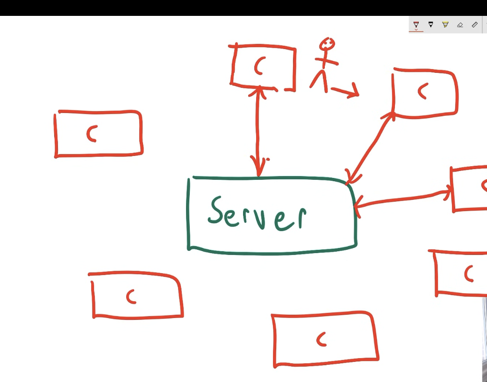
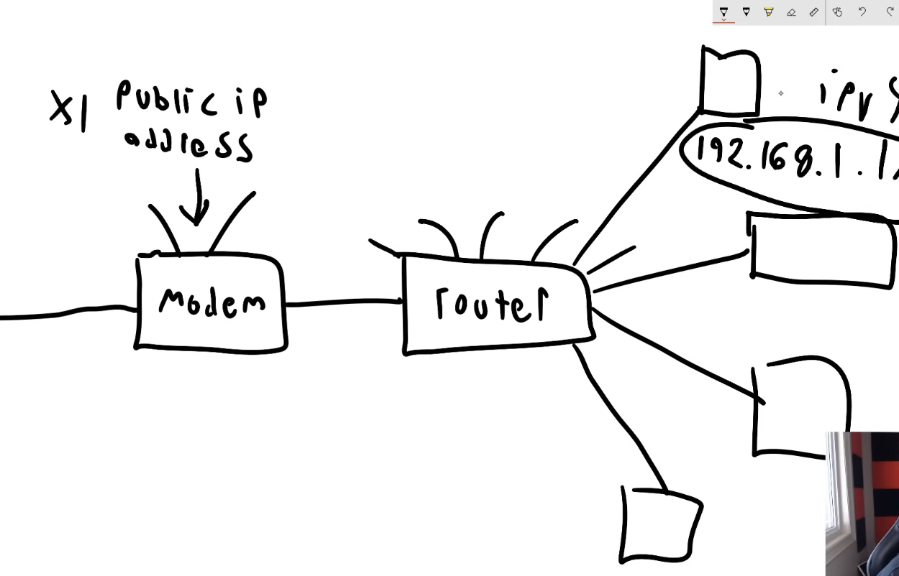

dealing with one server (we expand with multiple servers)

                clients
                    |
                    |
clients <--central server--> clients 
                    |
                    |
                clients

the central hoster must be faster
it connects to each diff client and vice-verse 
it sends info to the server and he sends back 

-one modem is giving one public IP address
-the router connects with each device in the network
